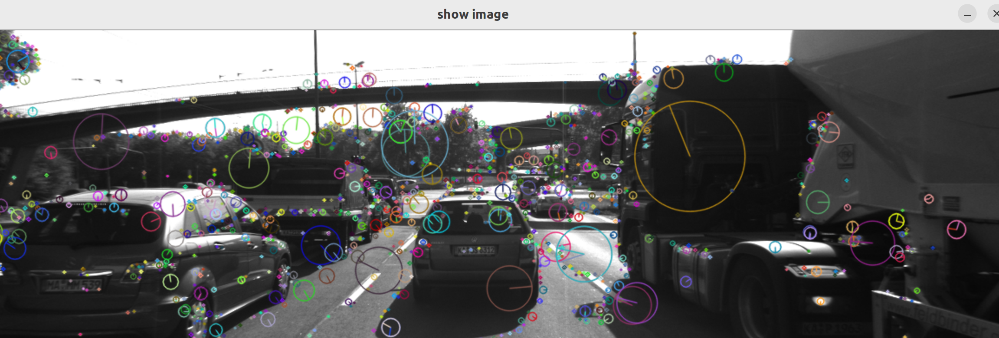
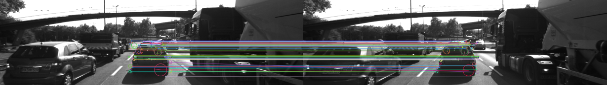

# 2D Feature Tracking

## Project Overview
Implement a vector for dataBuffer objects with limited size (e.g., 2 elements), pushing new elements in while removing old ones to prevent overflow.

## Implementation Steps

1. **Data Buffer Optimization**
  - Created ring buffer with constant size for storing images
  - Used dequeue for optimized constant lookup time and insertion/deletion

2. **Keypoint Detection**
  - Implemented multiple detectors (HARRIS, FAST, BRISK, ORB, AKAZE, SIFT)
  - Made them selectable via enum parameter
  - Used non-local maxima for HARRIS to extract only valuable keypoints

3. **Keypoint Filtering**
  - Removed all keypoints outside predefined rectangle
  - Focus on vehicle-only keypoints for collision time calculation

4. **Keypoint Description**
  - Implemented various descriptors (BRISK, BRIEF, ORB, AKAZE, SIFT)
  - Made them selectable via enum parameter

5. **Descriptor Matching**
  - Implemented both brute force and FLANN (with KDTree) matching
  - Added cross-checking to reduce false positives
  - Used k-nearest neighbors to find two closest matches and implemented distance ratio test between matches to filter out poor matches

6. **Performance Evaluation**
  - Counted keypoints on preceding vehicle across all images
  - Analyzed neighborhood size distribution
  - Measured matching performance across detector/descriptor combinations
  - Logged processing times for detection and extraction
  - Identified TOP3 detector/descriptor combinations based on performance

## Conclusion
My top three choices are:
1. **FAST + BRISK**: Good balance between speed and performance with good scale and rotation invariance
2. **FAST + ORB**: Strong performer with fast execution while maintaining quality descriptors and invariance properties
3. **AKAZE**: Most stable option with consistently good performance across all results.

Full evaluation results available in findings.txt

## Dependencies for Running Locally
1. cmake >= 3.22
2. make >= 4.1 (Linux, Mac), 3.81 (Windows)
3. OpenCV >= 4.5
4. c++17

## Basic Build Instructions

1. Clone this repo.
2. Make a build directory in the top level directory: `mkdir build && cd build`
3. Compile: `cmake .. && make`
4. Run it: `./collision_detection`.
